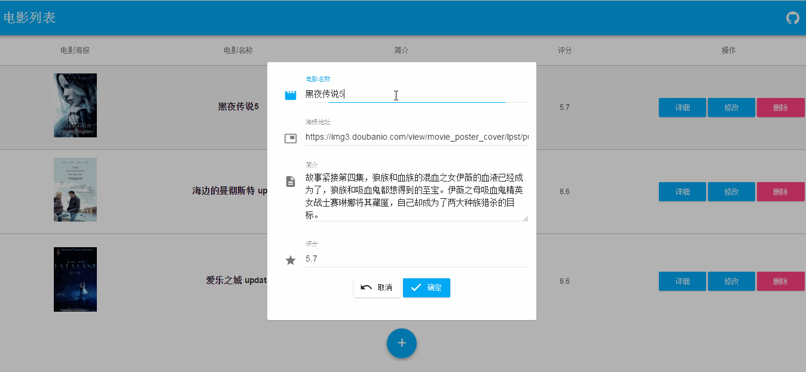
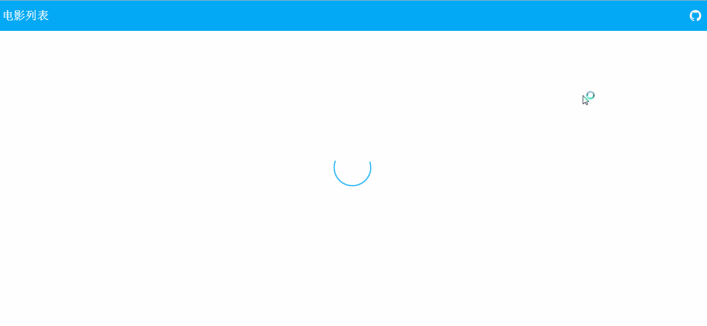
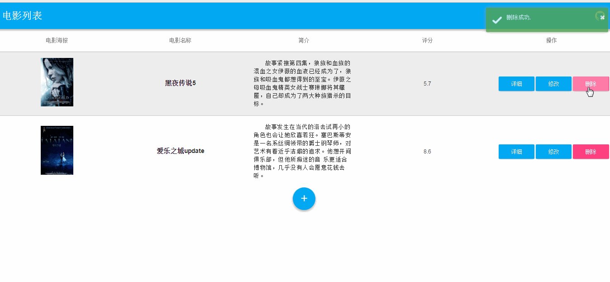

# 简介

一个前后端分离的案例,前端vue全家桶,后端express,数据库mongodb. 用express的提供api供前端调用,前端ajax请求进行对数据库的CURD操作.

# 效果图

编辑电影


显示电影详情


删除电影


# 开发环境

需要本地安装node,npm,mongodb

# 开启流程

``` bash

# 安装依赖
npm install

# 开启你的本地 mongodb
...

# 开启后端服务
node app.js

# 运行
npm run dev

# 打包
npm run build

```
